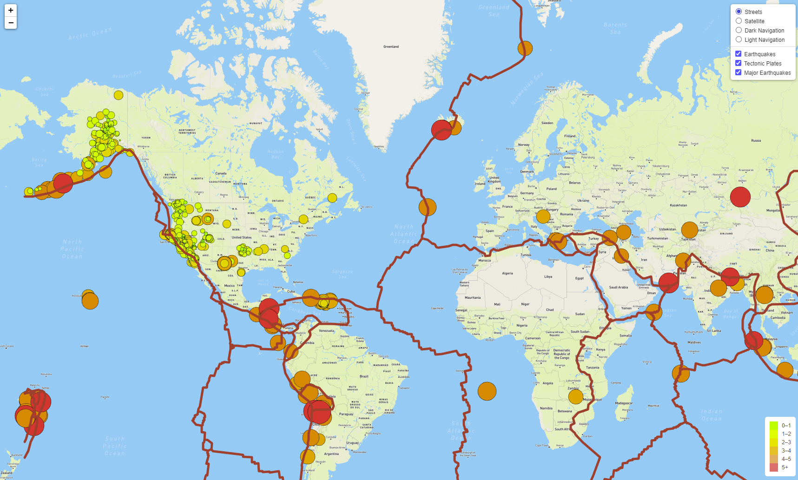
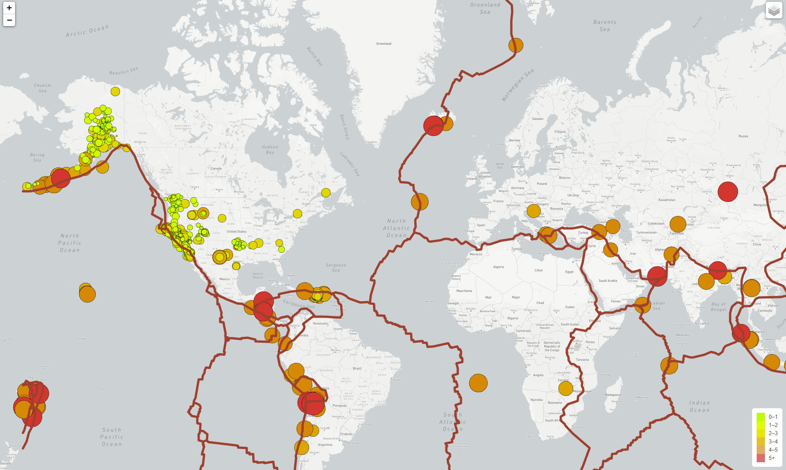
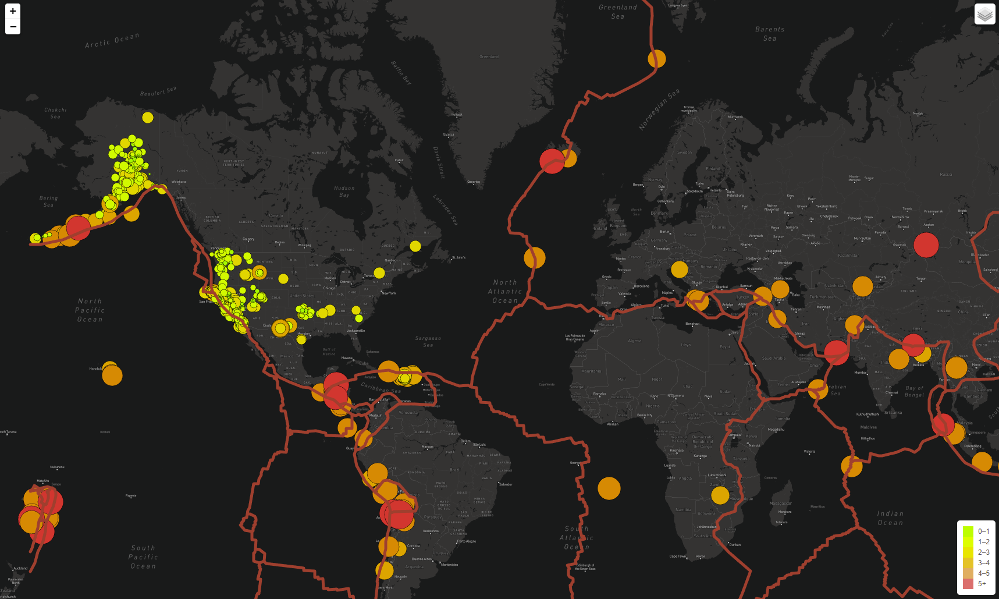

# Mapping Earthquakes

## Overview

Basil and Sadhana would like to see earthquake data in relation to the tectonic plates' location on the earth, and they would like to see all the earthquakes with a magnitude greater than 4.5 on the map. They would also like to see the data on a third map.

## Results

### Tectonic plates, earthquakes and major earthquakes

### Extra map styles

